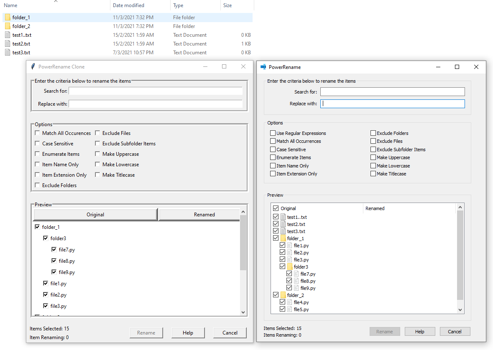
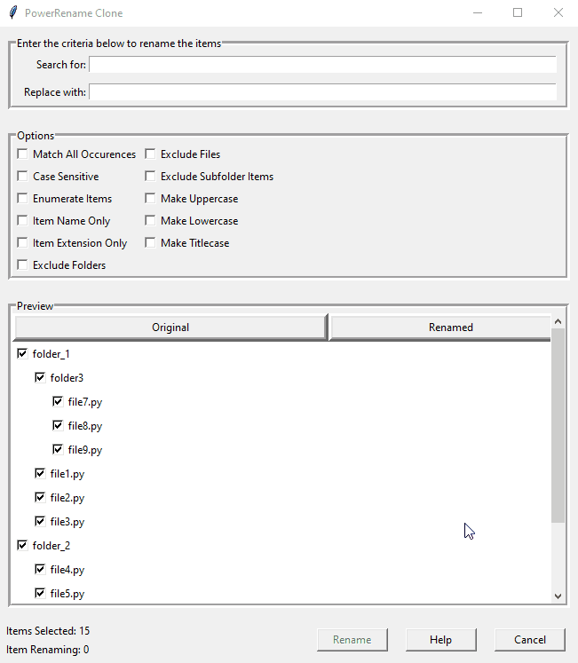
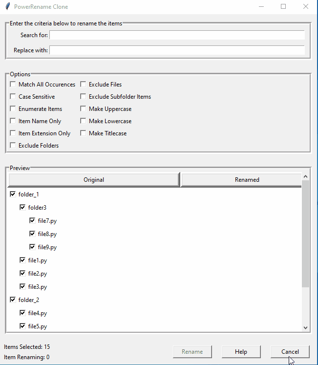
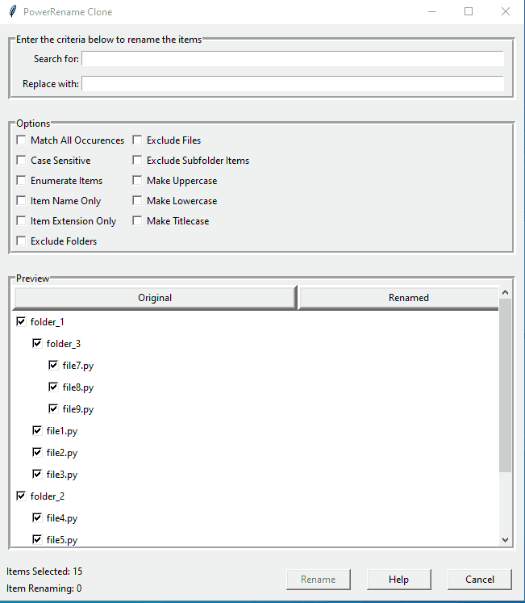
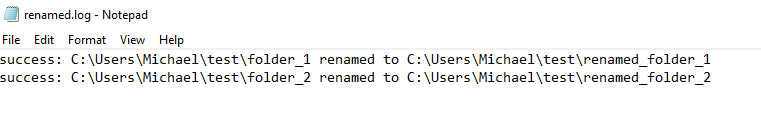

<!-- omit in toc -->
# **Power Rename Clone**
A clone that tries to emulate the functionalities provided by [Microsoft PowerRename utility](https://docs.microsoft.com/en-us/windows/powertoys/powerrename).
GUI made with tkinter framework.

<!-- omit in toc -->
## **Table of Content**
- [**Motivation**](#motivation)
- [**Notes**](#notes)
- [**Features**](#features)
- [**How to run**](#how-to-run)
- [**Screenshot**](#screenshot)
- [**Demo**](#demo)

## **Motivation**
- I came across the said tool while I was browsing the internet and I thought that this might be a suitable side project candidate
- The GUI looks simple to me and it was at the right timing since I just read the basics of Tkinkter [Python GUI Programming with Tkinter](https://realpython.com/python-gui-tkinter/)
- Besides, Im interested to better my understanding about working with files/folders in python

## **Notes**
- As this is just a very simple clone created to improve my progromming skills, do not expect it to behave exactly as the official utility as im just trying to emulate the features/behaviours that have shown in the article
- Hence, please use this program at your own risk

## **Features**
- Most of the features provided are based on the official article which the last updated date is 12/02/2020 [Microsoft PowerRename utility](https://docs.microsoft.com/en-us/windows/powertoys/powerrename)
- Notable features that are not supported is 
  - Perform a regular expression rename on multiple files
  - Undo a rename operation after it is completed
- For simple search and replace query, the program shall provide results that are same as the original utility

## **How to run**
- The program require an argument which is the directory where you would like to run the program 
- For example, type "python main.py C:\Users\Michael\Desktop\Folder_That_Contain_Files_To_Rename" and this program will scan all the folders/files within the directory and do the 
necessary initialization

## **Screenshot**

Side by side comparison with the original utility
- Note that the original utility list the files name first before folder names
- My program list the files and folders name based on the arrangement in the file explorer as you can see from the top left of the screenshot

## **Demo**

Demo 1 steps
- Search for "file"
- Sort preview section by clicking on "Renamed"
- Now, preview section only shows files that will be renamed
- Replace with "updated_"
- Select rename button
  

Demo 2 steps
- Search for "file"
- Replace using file creation date and time like how the original utility feature works [Replace using file and creation date and time](https://docs.microsoft.com/en-us/windows/powertoys/powerrename#replace-using-file-creation-date-and-time)
- Enable option "Enumerate Items"
- Select rename button

Demo 3 steps
- Search "file"
- Enable option "Exclude Files"
- Search "folder"
- Enable option "Exclude Subfolder items" which will reduce item renaming count from 3 to 2
- Replace "folder" with "outermost_folder_"
- Enable option "Make Titlecase"
- Select rename button

As the program closes after you clicked on the rename button, you are able to view the changes applied through a log file generated within the project directory.
For example,

